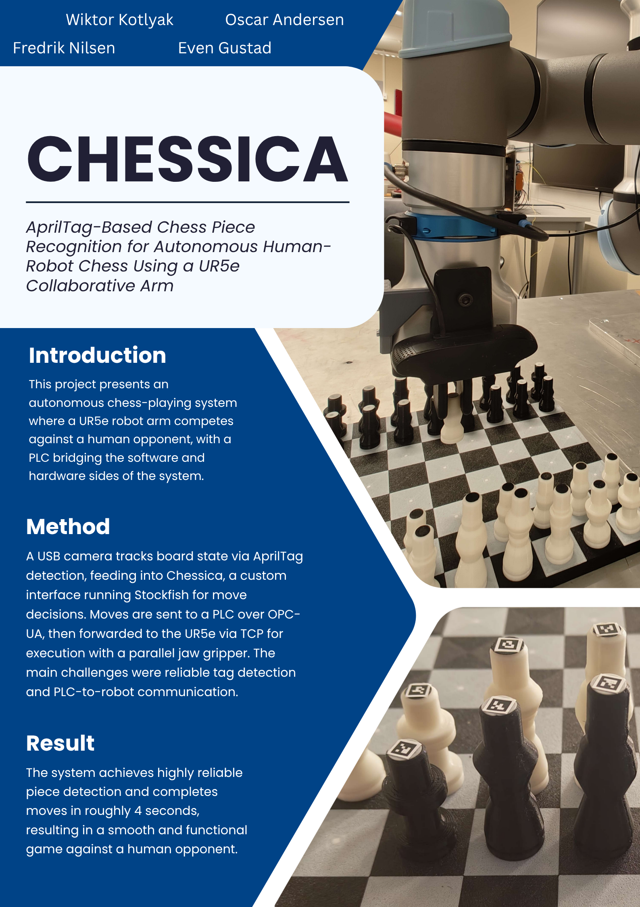
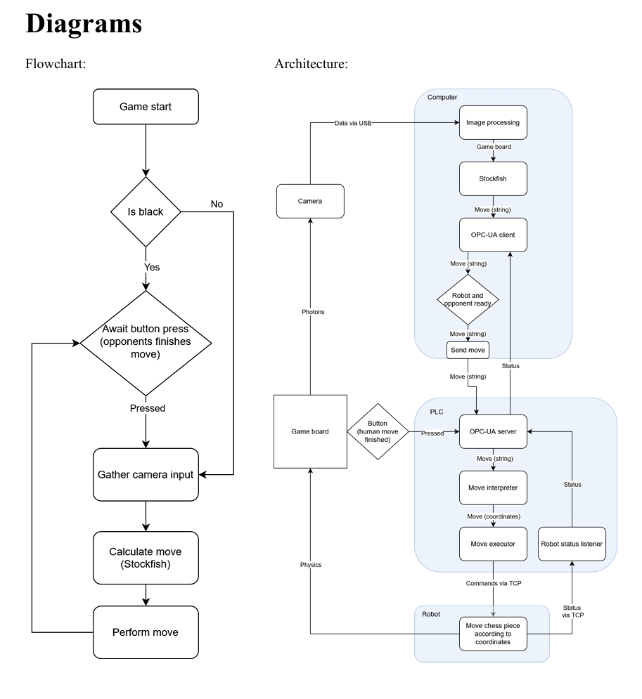

# Chessica

## Project Structure

`chessicaClientMain.py` is the main program running on the computer, serving as the entry point 
for the Chessica system. It coordinates the following modules:

- **Thinker** is the chess engine and responsible for move generation, game state 
management, and decision-making.
- **Observer** handles computer vision and AprilTag detection, tracking physical piece 
positions on the board.
- **Mover** contains the PLC program and Universal Robots script responsible for 
physically executing moves on the board.

> **Demo Video:** [Watch on YouTube](https://youtube.com/shorts/8n06mbnDMAk?feature=share)

---

## Project Poster

---

## System Diagram

